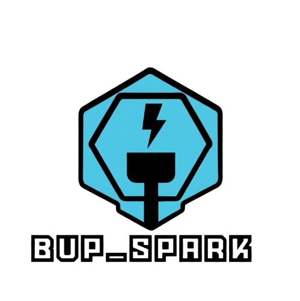

# BUP Spark ⚡

**BUP Spark** is a high-performance **Brand Intelligence Platform** designed to monitor, analyze, and simulate brand intelligence. It enables brand owners and marketers to build a **Brand Twin** (an AI-powered virtual replica of their brand's persona) to track market sentiment, analyze share of voice against competitors, and generate detailed executive brand analysis reports using Google's Gemini models.



---

## 🚀 Key Features

*   👥 **Brand Twin Builder**: Define your brand's core mission, tone of voice, product offerings, and top/secondary competitors to generate a customized intelligence persona.
*   📊 **Real-time Insights Dashboard**: Unified and elegant dashboard displaying:
    *   **Brand Score**: Overall performance indicator.
    *   **Total Mentions & Dynamic Sentiment Timeline**: Real-time representation of positive, neutral, and critical sentiments.
    *   **Share of Voice Map**: High-fidelity comparative analysis against key industry competitors.
    *   **Recent Mentions**: Tracks simulated platform feedback (Instagram, Facebook, TikTok, and News) with accurate Bengali and English sentiment labels.
*   🧠 **AI Brand Reports**: Single-click comprehensive executive briefs, high-contrast highlights, and recommended concrete action lists tailored directly to your brand profile.
*   🛡️ **Secure Full-Stack Proxying**: Keeps your Gemini API credentials secured on the server side instead of exposing them to client browsers.

---

## 🛠️ Architecture & Tech Stack

This application is built with a highly optimized **full-stack React & Express** design:

*   **Frontend**: React (v18+), Vite, and [Tailwind CSS](https://tailwindcss.com/) for fluid, modern, responsive aesthetics and typography.
*   **Backend Server**: Node.js & Express (`server.ts`) serving as a secure server-side proxy for handling Gemini model generation, avoiding API key leaks to browser inspector tools.
*   **AI Engine**: `@google/genai` powered by `gemini-3.5-flash` for high-speed, cost-effective content generation.
*   **Build System**: High-speed, robust automated output utilizing Vite for frontend bundle minification, and `esbuild` to compile backend TypeScript files into single, optimized CommonJS bundles (`dist/server.cjs`).

---

## 🔑 Environment Variables Configuration

Prior to executing or deploying the platform, configure the required environment keys. Refer to `.env.example` in the root folder structure:

```env
# GEMINI_API_KEY: Obtained from Google AI Studio (https://aistudio.google.com/)
GEMINI_API_KEY="your_api_key_here"

# APP_URL: Self-referential URL where this service operates (or localhost in dev)
APP_URL="http://localhost:3000"
```

### In Google AI Studio:
Toggle the **Secrets** menu/icon in Google AI Studio to set up and bind the `GEMINI_API_KEY` credential values securely without committing them to git.

---

## 💻 Local Development

Follow these simple steps to run BUP Spark locally:

1.  **Install Dependencies**:
    ```bash
    npm install
    ```
2.  **Set Environment Variables**:
    Create a `.env` file in the root directory:
    ```bash
    cp .env.example .env
    ```
    Add your actual `GEMINI_API_KEY` into `.env`.
3.  **Launch the Development Server**:
    ```bash
    npm run dev
    ```
    Your full-stack dev server is now active at `http://localhost:3000`.

4.  **Production Compilation**:
    ```bash
    npm run build
    ```
    This builds the static React bundle inside the `dist` folder and compiles the custom Node.js Express server to `dist/server.cjs`.

5.  **Run Production Build**:
    ```bash
    npm run start
    ```

---

## ☁️ How to Host & Deploy Publicly (100% Free Tiers)

Since this is a full-stack application with a Node.js companion script, static-only web hosts like GitHub Pages or Netlify's standard layer cannot run the backend routes. However, there are several outstanding **free cloud platform hosts** that support full-stack Node.js beautifully:

### Option 1: Render (Recommended & Easiest)
[Render](https://render.com/) offers a generous **Free Web Services** tier perfect for full-stack Node environments.

1.  Sign up for a free account at [render.com](https://render.com/).
2.  Connect your GitHub repository to Render.
3.  Select **New > Web Service**.
4.  Configure the settings as follows:
    *   **Runtime**: `Node`
    *   **Build Command**: `npm install && npm run build`
    *   **Start Command**: `npm run start`
5.  Scroll to **Environment Variables** and define:
    *   `GEMINI_API_KEY` = *(Your Google API Key)*
    *   `NODE_ENV` = `production`
6.  Click **Deploy Web Service**. Render will spin up the server container and provide you a public, secure `https` URL.

### Option 2: Google Cloud Run (Free Tier)
Google Cloud Run features a robust free tier of **2 million requests per month** which you are highly unlikely to exceed as an absolute project showcase.

1.  Install the Google Cloud CLI or deploy directly through **Google Cloud Build** linked to GitHub.
2.  Configure a simple `Dockerfile` (or use Google's automated buildpacks).
3.  Ensure port `3000` is targeted.
4.  Set up `GEMINI_API_KEY` inside the Cloud Run service environmental parameters dashboard.

### Option 3: Railway
[Railway](https://railway.app/) provides flexible starter credits on a developer trial that serves full-stack Dockerized and Node instances seamlessly.

1.  Log into Railway using your GitHub credentials.
2.  Create a **New Project** and select **Deploy from GitHub repo**.
3.  Add your repository. Railway automatically detects `package.json` configurations and provisions the app.
4.  Navigate to the **Variables** tab on your Railway dashboard and input:
    *   `GEMINI_API_KEY` = *(Your Google API Key)*
5.  Railway will provision a live public domain for your web platform.

---

*Crafted with ⚡ and precision.*
